  

## Currently Exploring

- Generative AI, LLM Applications & AI Systems
- AI Agents, MCP & Agentic AI
- Computer Vision & AI-powered Applications
- Agentic AI + IoT Systems
- Automated Machine Learning & Intelligent Automation
- Embedded Systems and Verilog Design

## Stack & Tools

  

  

  
  
  
  
  

## Currently Working On

### Thermal-Aware CPU Architecture

Developed **ThermoShift**, an AI-powered thermal management system that monitors temperature data and dynamically optimizes cooling for improved efficiency and performance.

**Tech:** Python, AI/ML, IoT, Sensor Data, Automation

### AI-Powered Conveyor Health Monitoring

An IoT + AI system where sensor data monitors conveyor health while computer vision detects cracks, tears, and misalignment, with ML models learning operating patterns for predictive maintenance.

### PacBot

An autonomous robotics platform that combines sensors, embedded programming, and AI to navigate and operate in real-world environments. It helps develop practical skills in Linux, Python/C++, control systems, MQTT, and MuJoCo.

### Logic Quest

Logic Quest is an FPGA and digital-design focused learning track that builds skills in Quartus, Verilog, RISC-V architecture, CPU design, digital circuits, PWM, and frequency scaling.

### INIT Website

Contributing to the development and maintenance of the INIT website, working on improvements and keeping the platform updated.

## Let's Connect

  
  

